# Azure Web PubSub Transport for Netcode for Gameobjects

Azure Web PubSub transport is designed to use Azure's managed realtime service to transfer data between unity server and clients.

Azure's managed Web PubSub service support `Websocket`, so if you are seeking solution for `Websocket` or extend your game to support `WebGL` platform, this transport is just for you.

This transport hides most of the technical details, all you need to do is to create an Azure Web PubSub service, and connect your service with a connection string.

What's more, with managed Azure Web PubSub service, you can have scalability, high availability, live monitoring, private link, auto-reconnect functionality and more.

> Before you read below, I highly recommend you to watch this TWO minutes video to get to know this transport
>
> Download unity package in Release page, the package is in queue to publish in Unity asset store.

## Setup Azure Web PubSub Service

Azure provides free SKU to create Web PubSub. Feel free to create one.

  [Quickstart: Create a Web PubSub instance from Azure portal](https://learn.microsoft.com/azure/azure-web-pubsub/howto-develop-create-instance)
  [Quickstart: Create a Web PubSub instance with Azure CLI](https://learn.microsoft.com/azure/azure-web-pubsub/quickstart-cli-create)

## Setup Unity

### Install Packages

Optional:

1. [Install ParrelSync](https://github.com/VeriorPies/ParrelSync#installation): ParrelSync is a Unity editor extension that allows users to test multiplayer gameplay without building the project by having another Unity editor window opened and mirror the changes from the original project.

### Setup Dev Negotiate Server

1. Copy connection string in `Keys` page of your Web PubSub service you just created.
2. Install [dotnet runtime](https://learn.microsoft.com/dotnet/core/install/) if you don't have one.
3. In `Proejct` view, right click `Packages/Azure Web PubSub Transport for Netcode for Gameobjects`, and click `Show in Explorer`.
4. Extact `Resources/NegotateServers_source.zip`  and go into the extracted folder `NegotateServers_source/AWPSNegotiateServer`, in `appsettings.json`, fill the connection string in `ConnectionString` section.
5. In terminal app, run `dotnet run` to start negotiation server.
6. Get listening URL in console log. For example: `Now listening on: https://localhost:7172`

### Setup Transport

1. Add `AzureWebPubSubTransport` component to your GameObject containing your NetworkManager.
2. Set the `Network Transport` field on the NetworkManager to the `AzureWebPubSubTransport`.
3. Enter a room name into the `Room Name` field of the `AzureWebPubSubTransport`.
4. Enter negotiate endpoint. For example, `https://localhost:7172/negotiate` if you use the builtin developing negotiate server.
5. Use the `StartServer`, `StartHost` and `StartClient` functions as usually to host a game and have clients connect to it.

> At this point, you should be able to exchanges data between unity server and client.

## Design Model

> So far, the transport should be able to use.
>
> The below sections is `optional` to read for explaining who to use Azure Web PubSub service to exhcange data between your server and clients.
> The folliowing contains details about how Unity and Azure Web PubSub service are connected.
> The following is useful to read when you scalability is in your plan.

This transport supports concept `room`, which allows a server and multiple clients to enter.
All clients in the same room will synchronize through a server, so that they can paly together.

Take Alice's room for an example.

Logically, the server and one client's connection is bidirectional communication. In order to do so, Azure Web PubSub service handles:

* Connection Negotiation: Servers and clients enter some room.
* Data Synchronization: Synchronize network data among server and clients.

### Negotiation Flow

> In generaral, negotiate webapp is used to redirect client/server connection to Azure Web PubSub service.
> The negotiate webapp can also be the same web app to your server.
> If you consider scalibility, consider keeping standalone negotiate web apps to handle Websockets connection request.

### Server Negotiation

1. Server requests redirect information from negotiate web app with the room name (_Alice's Room_).
2. Server established Websocket connection Azure Web PubSub service only when negotiate web app ensure there's no server subscribes to the room channel.

### Client Negotiation

1. Client requests redirect information from negotiate web app with the room name ((_Alice's Room_)).
2. Client establishes Websocket connection to Azure Web PubSub service only when negotiate web app ensures there's a server subscribes to the room channel.
3. Notify server via the room channel, that this client is connected.

### Client Data Synchroniazation: RPC in server

### Server Data Synchroniazation: Call RPC in client

